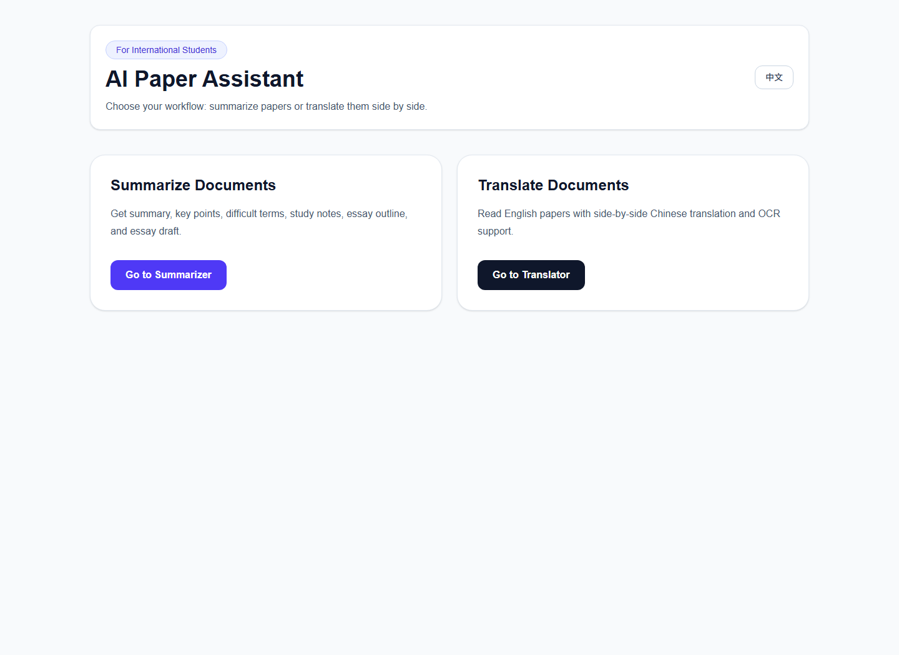

# AI Paper Assistant

AI Paper Assistant is a Next.js app for academic reading support. It focuses on two student workflows: summarising paper text and translating PDF content into a side-by-side reading view.

## Why I Built It

I built this as a personal study tool for reading academic papers more efficiently. The use case is simple: understand the main idea, collect key points, explain difficult terms and reduce the friction of reading English papers.

## What It Does

- Summarises pasted text or uploaded PDF content.
- Generates study notes, key points and difficult-term explanations.
- Uses Mistral OCR routes for PDF text extraction.
- Uses DeepSeek-compatible API routes for summarisation and translation.
- Uses Cloudflare R2-compatible storage routes for the PDF translation flow.
- Supports English and Chinese UI text.
- Exports generated notes as Markdown.

## Tech Stack

- Next.js 16
- React 19
- TypeScript
- Tailwind CSS
- OpenAI SDK with DeepSeek base URL
- Mistral OCR API
- AWS SDK for Cloudflare R2-compatible storage
- Tesseract.js and PDF parsing utilities

## Current Status

Working local prototype with implemented pages and API routes. The frontend can open without credentials, but live summarisation, OCR, PDF translation and R2 upload require valid environment variables.

## How to Run

```bash
npm install
cp .env.example .env.local
npm run dev
```

Open <http://localhost:3000>.

Required for full functionality:

```bash
DEEPSEEK_API_KEY=
MISTRAL_API_KEY=
R2_ENDPOINT=
R2_ACCESS_KEY=
R2_SECRET_KEY=
R2_BUCKET=
R2_PUBLIC_BASE_URL=
```

If these values are empty, the UI still loads, but the related API routes will return missing-configuration errors.

## Screenshot



## Limitations

- No built-in demo mode for summarisation without API keys yet.
- OCR quality depends on the uploaded PDF and external OCR response.
- No saved reading history or account system.
- File-size and usage-limit handling can be improved.

## Future Improvements

- Add a demo mode that works without external API keys.
- Add tests for API routes and upload error handling.
- Improve fallback handling for scanned or low-quality PDFs.
- Save generated notes locally for later review.
- Add clearer file-size validation before upload.

## What I Learned

This project helped me understand the practical parts of document AI apps. File upload, OCR, model calls, object storage and user-facing error handling all need to work together.

## 中文简介

AI Paper Assistant 是一个论文阅读辅助工具，主要用于英文论文的总结、术语解释和 PDF 翻译阅读。当前版本已经完成主要页面和 API 路由，但真正调用总结、OCR、翻译和 R2 存储时需要配置对应的 API key。

作者：Shiyun Ni

## License

MIT. See [LICENSE](LICENSE).
